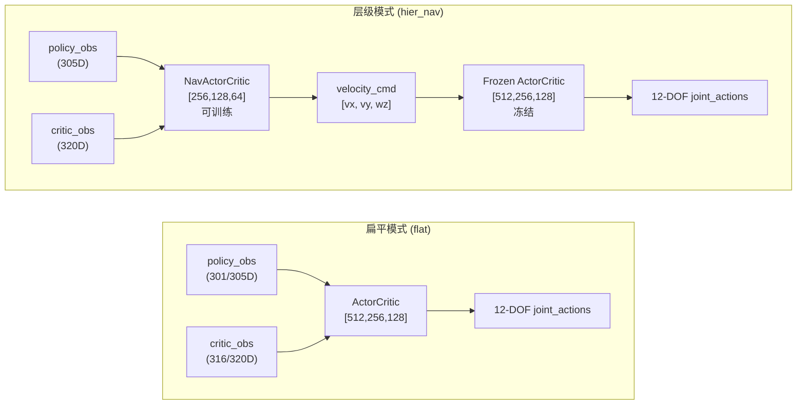
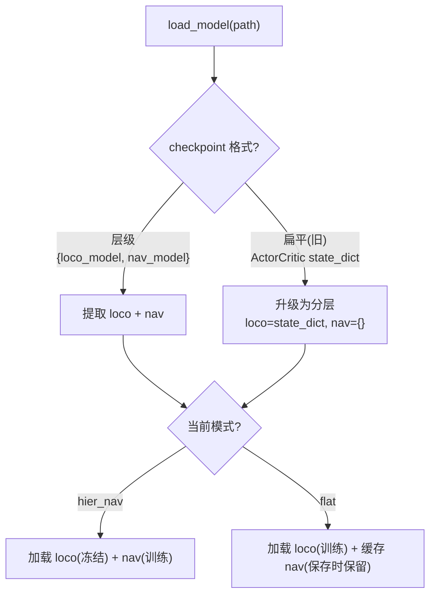

# agent_ppo

## 模型架构

### 总览



### 模型对比

| | ActorCritic (运控) | NavActorCritic (导航) |
|---|---|---|
| **用途** | 关节级运动控制 | 高层速度指令决策 |
| **输出** | 12-DOF 关节位置 | 3D 速度指令 `[vx, vy, wz]` |
| **Actor MLP** | [512 → 256 → 128] → 12 | [256 → 128 → 64] → 3 |
| **Critic MLP** | [512 → 256 → 128] → 1 | [256 → 128 → 64] → 1 |
| **隐藏层激活** | ELU | ELU |
| **Actor 输出层** | Linear (无界 raw) | Linear → Tanh → 仿射映射 |
| **Actor 输出范围** | (-∞, +∞) | [cmd_lower, cmd_upper]，hier_nav: vx=1.5(固定),vy∈[-0.8,0.8],wz∈[-1.5,1.5] |
| **Actor LayerNorm** | 无 | 每个隐藏层后有 |
| **Critic LayerNorm** | 隐藏层后有 | 隐藏层后有 |
| **Actor 权重初始化** | 默认 PyTorch init | 正交初始化 (gain=0.01) |
| **Critic 权重初始化** | 默认 PyTorch init | 正交初始化 (gain=1.0) |
| **init_noise_std** | 1.0 | 0.5 |
| **训练状态** | 层级模式时冻结 | 始终可训练 |

### 原始观测 → 处理后观测布局

环境原始观测:

```
policy_obs (305D):
  [0:3]    base_ang_vel(3)    } 
  [3:6]    projected_gravity(3)} proprio(45)
  [6:9]    velocity_cmd(3)    }
  [9:21]   joint_pos(12)      }
  [21:33]  joint_vel(12)      } proprio(45)
  [33:45]  last_action(12)    }
  [45:301] height_scan(256)   — scan
  [301:305] goal(4)           — task info

critic_obs (320D):
  [0:3]    base_lin_vel(3)    ← 特权, policy 没有
  [3:6]    base_ang_vel(3)    }
  [6:9]    projected_gravity(3)} critic_proprio(60)
  [9:12]   velocity_cmd(3)    }
  [12:24]  joint_pos(12)      }
  [24:36]  joint_vel(12)      }
  [36:48]  joint_effort(12)   ← 特权, policy 没有
  [48:60]  last_action(12)    }
  [60:316] height_scan(256)   — scan
  [316:320] goal(4)           — task info
```

处理后观测路由:

| 模型 | obs 来源 | 维度 | 内容 |
|------|---------|:---:|------|
| **Loco** | `_build_loco_obs(obs, nav_cmd)` | 301 | proprio(45, cmd 替换为 nav 输出) + scan(256) |
| **Nav Actor** | `_build_nav_obs(obs)` | 266 | base_ang_vel(3) + projected_gravity(3) + scan(256) + goal(4) |
| **Nav Critic** | `_build_nav_critic_obs(critic_obs)` | 269 | base_lin_vel(3) + base_ang_vel(3) + projected_gravity(3) + scan(256) + goal(4) |

各模型用到的原始字段:

| 原始字段 | 维度 | Loco | Nav Actor | Nav Critic |
|----------|:---:|:---:|:---:|:---:|
| base_lin_vel | 3 | — | — | ✓ (特权) |
| base_ang_vel | 3 | ✓ | ✓ | ✓ |
| projected_gravity | 3 | ✓ | ✓ | ✓ |
| velocity_cmd | 3 | ✓ (由 nav 替换) | — | — |
| joint_pos/vel/last_action | 33 | ✓ | — | — |
| joint_effort | 12 | — | — | — |
| height_scan | 256 | ✓ | ✓ | ✓ |
| goal | 4 | — | ✓ | ✓ |

### nav_obs 构建逻辑

```python
# Loco: proprio + scan, velocity_cmd 被 nav 输出替换
_build_loco_obs(obs, nav_actions):
    loco_obs = obs[:, :301]           # proprio(45) + scan(256)
    loco_obs[:, 6:9] = nav_actions  # 替换随机 velocity_cmd
    return loco_obs                    # 301 dim

# Nav Actor: 基础机身状态 + scan + goal (无 cmd, 无关节)
_build_nav_obs(obs):
    obs[:, :6]   = base_ang_vel(3) + projected_gravity(3)   # body state
    obs[:, 45:]  = height_scan(256) + goal(4)               # perception + task
    return cat → 266 dim

# Nav Critic: 特权机身状态 + scan + goal
_build_nav_critic_obs(critic_obs):
    critic_obs[:, :9]  = base_lin_vel(3) + base_ang_vel(3) + projected_gravity(3)
    critic_obs[:, 60:] = height_scan(256) + goal(4)
    return cat → 269 dim
```

### 关键设计决策

- **Nav 输出有界**: Tanh 压缩输出到 [-1, 1]，再仿射映射到 [cmd_lower, cmd_upper]。hier_nav: `vx=1.5(固定)`、`vy∈[-0.8, 0.8]`、`wz∈[-1.5, 1.5]`；hier_nav_maze: `vx∈[-0.8, 0.8]`、`vy∈[-0.3, 0.3]`
- **Nav Actor 没有 base_lin_vel**: 线速度只在 critic_obs 中，是特权信息。nav actor 只用 `base_ang_vel + projected_gravity`，训推一致
- **Nav Actor 没有 velocity_cmd**: policy_obs[6:9] 的 velocity_cmd 来自环境 command_manager 的随机采样，跟 nav 输出无关，是噪声
- **Nav Critic 有 base_lin_vel**: 不对称 Actor-Critic，critic 用特权信息把 value 估得更准
- **Loco 的 velocity_cmd 被 nav 替换**: `_build_loco_obs` 把随机 velocity_cmd 换成 nav 输出的真实指令，loco 跟踪的是 nav 的指令而非随机指令

---

## 模型加载与 checkpoint 兼容性

层级训练（hier_nav）和扁平训练（standard/track e2e）的 checkpoint 可以**互相加载**，自动识别格式。

### checkpoint 格式

| 格式 | 内容 | 产生方式 |
|------|------|---------|
| 层级 | `{"loco_model": ..., "nav_model": ...}` | 所有 `save_model` 统一输出（nav 可能为空 `{}`） |

> 加载兼容扁平旧格式 `ActorCritic.state_dict()`，自动升级为分层。

### 加载行为



### 日志关键字

| 日志 | 含义 |
|------|------|
| `[Load] Hierarchical checkpoint` | 检测到分层 ckpt |
| `[Load] Legacy flat checkpoint → upgrading` | 检测到旧扁平 ckpt，自动升级 |
| `[Load] loco/nav weights loaded (exact match)` | 权重完全匹配 |
| `[Load] loco/nav weights loaded (partial)` | 权重形状不匹配，裁剪加载 |
| `[Load] No nav_model in checkpoint` | ckpt 缺 nav，nav 从头训 |
| `[Load] nav_model cached` | flat 模式缓存 nav，保存时保留 |

### 典型工作流

```python
# 1. standard 训运控
Config.CURRENT = AllTerrainConfig

# 2. 切换 hier_nav，自动从 flat ckpt 加载 loco
Config.CURRENT = TrackHierNavMazeConfig
# 日志: [HierLoad] Flat checkpoint → loading as loco only. Nav will train from scratch.

# 3. 续训 hier_nav，加载层级 ckpt（含 nav）
Config.CURRENT = TrackHierNavConfig
# 日志: [HierLoad] nav_model weights found — loading nav from checkpoint

# 4. 回退 standard 继续训运控，从层级 ckpt 提取 loco，缓存 nav → 保存时自动恢复分层格式
Config.CURRENT = AllTerrainConfig
# 日志: [FlatLoad] Hierarchical checkpoint → extracting loco_model, nav_model cached for save
# 保存始终输出层级格式 {"loco_model": ..., "nav_model": ...}，后续 track 可直接续训
```
